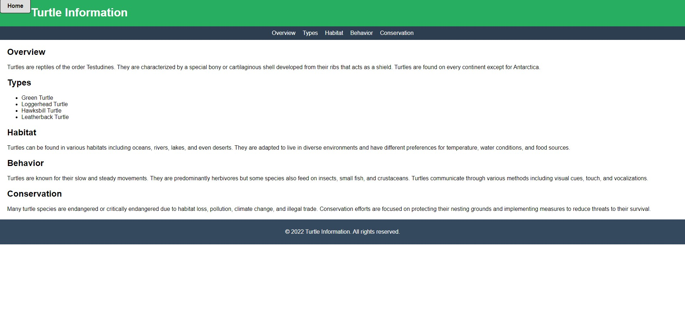
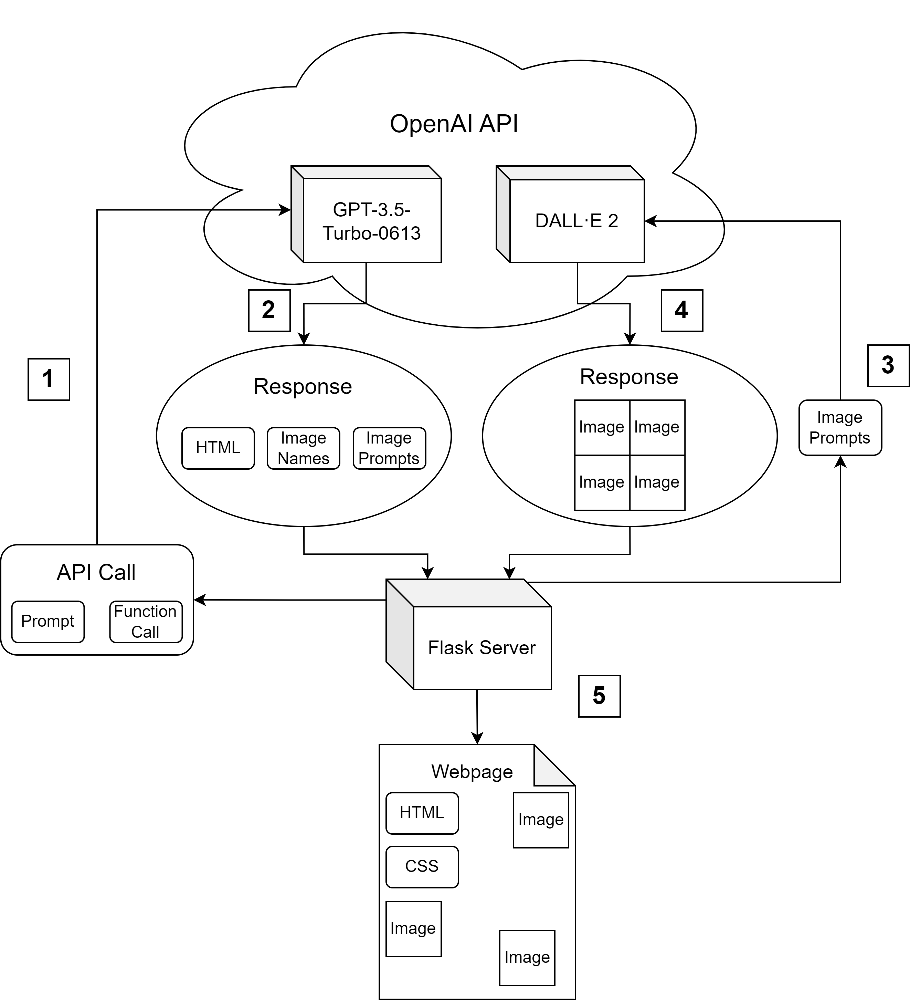
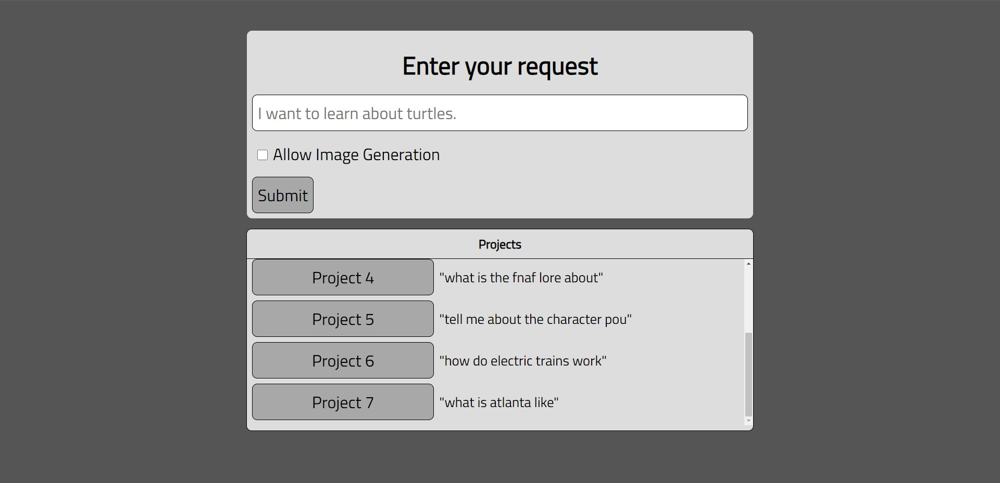
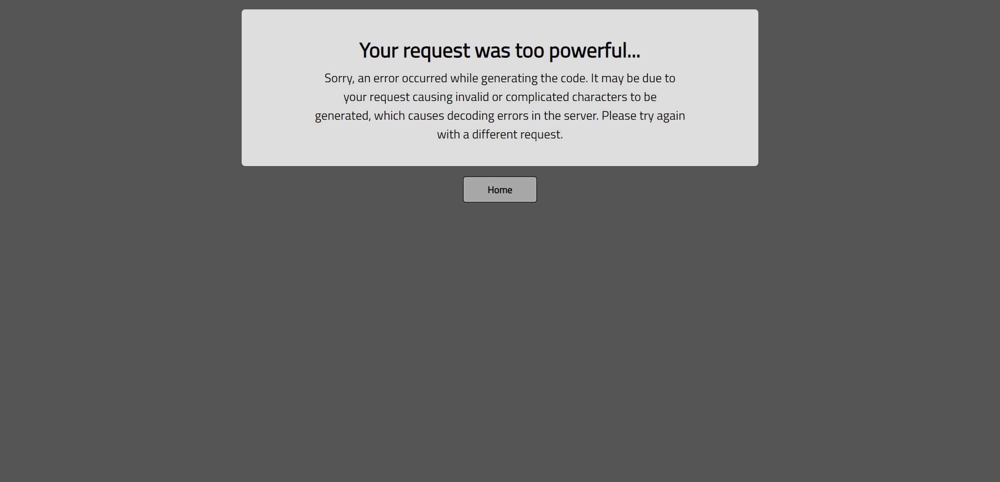

# Capstone Logbook

<h2>Entries:</h2>
<h3>9/25/23</h3>
I added a loading icon that pops up when the model is generating.
Then, I restructured the GPT function from just a general "code" argument that would output a full html file to three arguments: html, css, and js.  This allows me to split the HTML, CSS, and JavaScript code into separate files and makes the model's outputs more reliable and capable.  So far, the websites generated after this change have had better styling, functionality, and general completion of the request.  The bug where it would return the prompt in restated in plaintext instead of actual code has not showed up ever since this change as well.

<h4>Screenshot of a generated page about turtles after the function restructure:</h4>

<h3>9/28/23</h3>
I added comments to the flask app code, and I also created a button that links to the last generated website.  This allows the user to see their last generation without having to type in the exact same query again.  I also fixed the fonts on the input elements and made other styling changes.

<h3>10/4/23</h3>
I played around with using multiple responses to build up the website instead generating it all in one response.  However, this proved to create formatting and encoding issues.  Currently, the method of generating the website all at once is the best working, but the prompt has been modified.  The modifications, which primarily shortended it, led to poorer quality websites.  I may have to revert to past prompt.

<h3>11/7/23</h3>
A refresh of the project has occurred since the last entry.  It now generates the full HTML for a website, and the user can select from many premade bootstrap CSS stylesheets with a small menu on the generated website.  It also has the capability to generate the images needed for the website, such as visual aids for the content in the website.

<h3>11/10/23</h3>
The project overall works very well, but time consumption is a minor issue as it takes quite a while to generate the images and content.  Measuring the elapsed time and comparing it to the length of the generations is one way of studying its performance and will be used to test it.  Plotting the time elapsed vs. length of content would be a great way to visualize this.

A checkbox to enable image generation was added to the home page, and a diagram of the program was also created.

<h3>11/13/23</h3>
I plan to add the conversational feature to the application next.  This requires redesigning the /lastgen endpoint to support this new functionality while keeping the user interface flowing well.

<h3>12/7/23</h3>
The conversational feedback feature has been implemented.  However, a more useful implementation would allow the user to return to past iterations instead of simply replacing the page with the new generation.

<h3>12/10/23</h3>
There were some bugs in the CSS of the home page that I fixed.  I also added a project list that would update as new projects were created and changed the layout of the home page.

<h3>12/11/23</h3>
I created an error page to smoothen the user experience and allow them to return to the home page when an error ocurrs.  Without this error handling, the user would have to manually press the back button, and empty project directories would still be present.  When the server detects an error that ruins the project, it automatically deletes the directory and redirects the user to the error page.

<h1 align="center">GitHub Repo</h1>

    

